# Orian Voice Wake Word ("Hello Orian") Architecture

This document details the technical design and architectural specifications for implementing background **Wake Word Detection ("Hello Orian")** on mobile devices and browsers.

---

## 1. Architectural Overview

To allow Orian to trigger voice command listening hands-free, the application must continuously analyze microphone input in a low-power "sleep" state. Once the phrase **"Hello Orian"** is spotted, the app wakes up, plays a system chime, and transitions to the active voice command recognition loop.

```mermaid
sequenceDiagram
    participant User
    participant Browser as Browser Client
    participant KWS as Wake Word Detector (Client-Side)
    participant UI as Neural Schema (UI)
    participant API as Python FastAPI Backend

    Note over Browser, KWS: App is in passive standby state
    User->>Browser: Says "Hello Orian"
    Browser->>KWS: Streams low-frequency mic audio
    KWS->>KWS: Process voice features (Spectrogram)
    KWS-->>Browser: Keyword "Hello Orian" Detected!
    
    rect rgb(10, 25, 50)
        Note over Browser, UI: Wake-Up Trigger Sequence
        Browser->>Browser: Play wake sound chime
        Browser->>UI: Trigger circular core expand & glow
        Browser->>Browser: Start full command Audio Recorder
    end
    
    User->>Browser: Speaks command (e.g. "open chrome")
    Browser->>Browser: User stops speaking / silence detected
    Browser->>API: Post recorded command.wav to /api/sense/voice
    API-->>Browser: Returns transcript & execution payload
    Browser->>Browser: Speak command feedback
```



---

## 2. Technical Comparison of Approaches

We evaluate three implementation strategies for mobile browsers:

| Metric | Option A: Web Speech API (Native) | Option B: Picovoice Porcupine (Wasm) | Option C: WebSocket Streaming (Server) |
| :--- | :--- | :--- | :--- |
| **Description** | Uses browser's native `webkitSpeechRecognition` running in continuous mode. | Low-latency WebAssembly wake word spotter running locally. | Stream mic raw buffer to FastAPI via WebSockets. |
| **Accuracy** | High (Cloud-backed NLP on Android). | Extreme (Industrial-grade local KWS). | High (uses Whisper/VAD on local PC). |
| **Latency** | Medium (~400ms after utterance). | Low (~100ms, offline). | High (network bound). |
| **Battery Impact** | Low (Optimized by Android OS). | Medium (Constant Wasm processing). | High (Heavy constant Wi-Fi upload). |
| **Network Dependency**| Yes (requires internet). | **No (100% offline local processing)**. | Yes (high bandwidth). |
| **Licensing** | Free / Native. | Free Tier (requires developer key). | Free / Self-hosted. |

### Recommended Choice: Option A (Web Speech API) with Wasm Fallback
For mobile browsers (specifically Android Chrome), **Option A** is the most reliable, battery-efficient, and zero-configuration approach. We will implement a resilient wrapper that keeps a low-resource native recognizer running in the background and restarts it automatically if it times out.

---

## 3. Detailed Component Architecture

### A. Wake Word Listener Lifecycle

```
[Standby State] ──> (Speech Detected) ──> [Word Matcher]
       ▲                                         │
       │                                         ▼ (Match "hello orian")
[Standby State] <── (Audio Finished) <── [Command Recording Mode]
```

1. **Standby State**: The app is in idle background listening mode. The central microphone icon is inactive, and the background Neural Schema rotates slowly.
2. **Detection**:
   * The continuous speech recognizer listens for the token stream.
   * If a phrase containing `"hello orian"` or `"orian"` is detected, the wake-up handler is fired.
3. **Wake-Up Trigger**:
   * Instantly suspends the background wake-word listener to free up the microphone.
   * Plays the `playMicActivate` sci-fi synthesizer sound effect.
   * Expands the **Neural Schema** scale and triggers the active cyan pulse.
   * Launches the full quality **Audio Recorder**.
4. **Command Recording Mode**: Records the user's speech until a pause/silence is detected.
5. **Uplink & Reset**:
   * Sends the audio blob to the FastAPI backend.
   * Speaks the response feedback.
   * Resets the system state and automatically restarts the background **Wake Word Listener**.

---

## 4. Implementation Design

### File Modification Map

#### 1. [config.js](file:///f:/major%20project/orionAI/src/config.js)
Define configuration flags for wake word activation.
```javascript
export const WAKE_WORD = "hello orian";
export const ENABLE_WAKE_WORD = true;
```

#### 2. [VoiceContext.jsx](file:///f:/major%20project/orionAI/src/context/VoiceContext.jsx)
We will add a new background listener state and utility function `startWakeWordListener()`.
```javascript
const [isWakeWordListening, setIsWakeWordListening] = useState(false);

const startWakeWordListener = useCallback(() => {
  if (!('webkitSpeechRecognition' in window)) return;
  
  const recognition = new window.webkitSpeechRecognition();
  recognition.continuous = true;
  recognition.interimResults = true;
  recognition.lang = 'en-US';

  recognition.onresult = (event) => {
    for (let i = event.resultIndex; i < event.results.length; ++i) {
      if (event.results[i].isFinal) {
        const transcript = event.results[i][0].transcript.toLowerCase();
        if (transcript.includes('hello orian') || transcript.includes('orian')) {
          recognition.stop();
          triggerWakeUp(); // Custom event to start recording
        }
      }
    }
  };

  recognition.onerror = () => {
    // Auto-restart on error or timeout
    setTimeout(startWakeWordListener, 1000);
  };

  recognition.start();
}, []);
```

#### 3. [FirstPageLayout.jsx](file:///f:/major%20project/orionAI/src/pages/FirstPageLayout.jsx)
Wire up the `useEffect` to activate the listener when the mobile device goes to standby mode, and play the cyberpunk wake-up sound (`playMicActivate`).

---

## 5. Mobile & Android Specific Optimizations

> [!IMPORTANT]
> To ensure continuous operation on Android Mobile devices:
> 1. **Permission Guard**: Request microphone access explicitly upon the first user interaction (clicking the bottom-right circular button). Mobile browsers block background microphone usage until the user has interacted with the document.
> 2. **Wake Lock API**: Utilize the browser's `navigator.wakeLock` to prevent the mobile screen from turning off and suspending the browser tab while background listening is active.
> 3. **Resilient Restart**: Android Chrome shuts down continuous speech recognition tasks after 10-15 seconds of silence. The listener must catch the `onend` event and instantly restart itself to remain active permanently.
